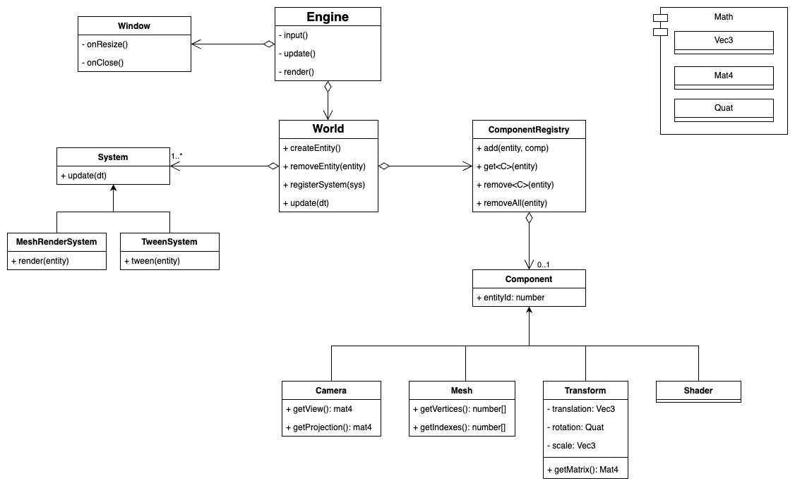

# GGenie
This is a 3d engine using opengl and ECS architecture



# Build and Run

## Install Python
```
pyenv install 3
```
or other way

## Install Conan 
[Conan install guide](https://docs.conan.io/2/installation.html)
<details>
  
<summary>pyenv-virtualenv install</summary>

**_Inside project directory_**
```
pyenv virtualenv 3.13.3 ggenie_env
pyenv local ggenie_env
pip install conan
```
</details>
<details>

<summary>Global install</summary>

```
pip install conan
```
</details>

## Build
```
conan install . -s build_type=Debug
cmake --preset=conan-debug
cmake --build --preset conan-debug 
```

## Run
```
build/Debug/engine3d
```
