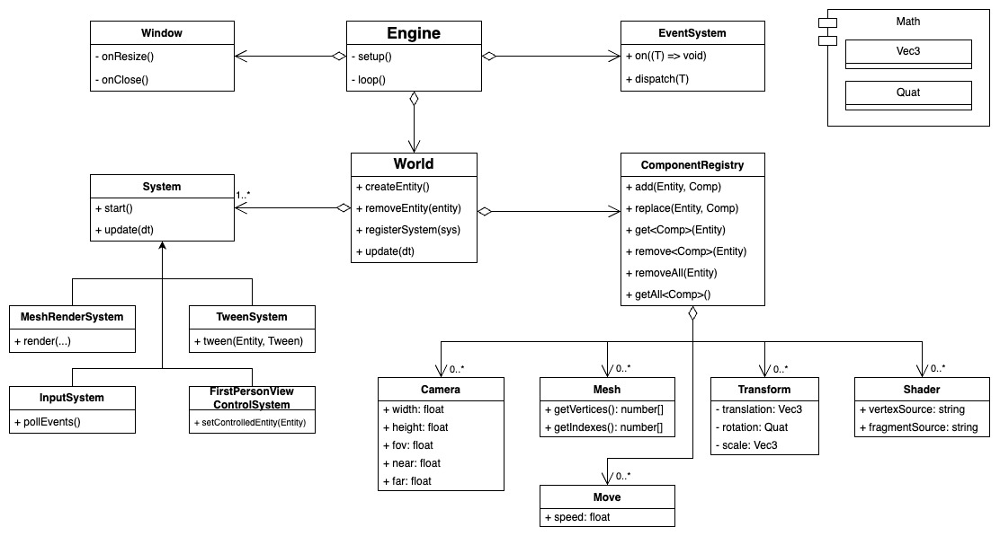

# GGenie
This is a 3d engine using opengl and ECS architecture



# Build and Run

## Install Python
```
pyenv install 3
```
or other way

## Install Conan 
[Conan install guide](https://docs.conan.io/2/installation.html)
<details>
  
<summary>pyenv-virtualenv install</summary>

**_Inside project directory_**
```
pyenv virtualenv 3.13.3 ggenie_env
pyenv local ggenie_env
pip install conan
```
</details>
<details>

<summary>Global install</summary>

```
pip install conan
```
</details>

## Build
```
conan install . -s build_type=Debug --build=missing
cmake --preset=conan-debug
cmake --build --preset conan-debug 
```

## Tests
Tests use [Catch2](https://github.com/catchorg/Catch2)
```
build/Debug/tests
```

## Run
```
build/Debug/GGenie
```

# Lint and format
## Setup
clang-tidy and clang-format used for linting and formating
They should be installed and available with commands `clang-tidy` and `clang-format`
One way to get them is build from sources([Getting the Source Code and Building LLVM](https://llvm.org/docs/GettingStarted.html#getting-the-source-code-and-building-llvm)):
1. Clone [llvm-project](https://github.com/llvm/llvm-project)
2. Checkout the right version (as your local clang compiler if you have one). For example `git checkout llvmorg-17.0.6`
3. Install [Ninja](https://ninja-build.org/)
4. Build base llvm and install it to some local dir, for example $HOME/clang-tools
    ```
    cmake -S llvm -B build-llvm -G Ninja \
    -DCMAKE_BUILD_TYPE=Release \
    -DCMAKE_INSTALL_PREFIX=$HOME/clang-tools
    cd build-llvm
    ninja install
    cd ..
    ```
5. Build clang and clang-tools-extra and install them the same way
    ```
    cmake -S llvm -B build-tools -G Ninja                                                             
    -DCMAKE_BUILD_TYPE=Release \
    -DLLVM_ENABLE_PROJECTS="clang;clang-tools-extra" \
    -DCMAKE_INSTALL_PREFIX=$HOME/clang-tools
    cd build-tools
    ninja install
    cd ..
    ```
6. Add builded tools to your path. Add them to the end of PATH if you don't want to override system clang install
    ```
    export PATH="$PATH:$HOME/clang-tools/bin"
    ```
7. Also use this Perplexity [thread](https://www.perplexity.ai/search/kak-sobrat-iz-iskhodnikov-i-us-SPQWh9bMTpyArh4ZtVP.EA) if you have troubles building from source 
## Usage
Manual formatting: `cmake --build --preset conan-debug --target format`\
Manual linting: `cmake --build --preset conan-debug --target tidy`\
Lint report only: `cmake --build --preset conan-debug --target tidy-report`\
Lint fix: `cmake --build --preset conan-debug --target tidy-fix`
